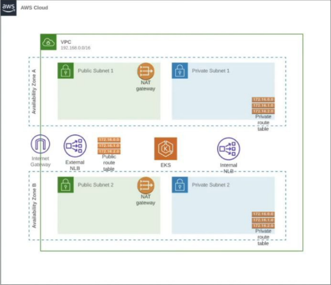

# In this Terraform EKS Cluster Creation playlist, first, we will create AWS VPC with Terraform and create an EKS cluster with an instance group. Terraform EKS Cluster Example will conform with AWS best practices. AWS VPC will contain two subnets in each availability zone. We will have two public subnets to create load balancers and expose our Kubernetes services to the internet and two private subnets to hold our Kubernetes nodes. Also, we will create two nat gateways to provide high availability for our Kubernetes workers.

## AWS Credentials

To securely manage your AWS credentials, do not hardcode them in your Terraform files. Instead, use one of these methods:

1. AWS CLI: Run `aws configure` in your terminal to set up your credentials.
2. Environment Variables: Set `AWS_ACCESS_KEY_ID` and `AWS_SECRET_ACCESS_KEY` in your shell:

export AWS_ACCESS_KEY_ID="your_access_key"
export AWS_SECRET_ACCESS_KEY="your_secret_key"

3. AWS Credentials File: Store your credentials in `~/.aws/credentials`.
4. IAM Role: If running on an EC2 instance, use an IAM role for access.

Choose the method that best fits your workflow and security requirements. Never commit credentials to version control.

